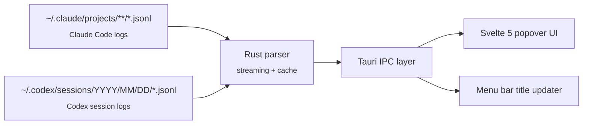

<p align="center">
  
</p>

<h1 align="center">TokenMonitor</h1>

<p align="center">
  <strong>Native macOS menu bar monitor for Claude Code and Codex usage</strong>
</p>

<p align="center">
  Track spend, tokens, activity windows, and per-model breakdowns directly from local session logs.
</p>

<p align="center">
  
  
  
  
  
  
</p>

---

TokenMonitor lives in your menu bar and gives you a fast, local view of how much you are spending on AI coding assistants. It reads Claude Code and Codex session logs directly from disk, computes pricing locally, and renders the results in a native-feeling popover.

No API keys. No cloud sync. No external CLI dependency.

## Why TokenMonitor

- Accurate pricing for Anthropic 5-minute vs 1-hour cache writes
- Native Rust parser instead of subprocessing a third-party usage tool
- Local-first architecture that reads `~/.claude` and `~/.codex` directly
- Menu bar UX with background refresh, launch-at-login, and configurable tray display
- Per-model breakdowns and activity views that are useful day to day, not just for post-hoc reporting

## Features

- Native macOS menu bar app with popover UI
- Claude Code, Codex, and combined `all` provider views
- `5h`, `day`, `week`, `month`, and `year` time ranges
- Real-time tray title showing today's spend, with an option to hide it
- Per-model cost and token breakdowns
- Activity-window view for the `5h` tab
- Background refresh with configurable cadence
- Theme, provider, period, currency, and model-visibility settings
- Correct handling of cache token pricing and cached-input discounts
- Local parsing and in-memory caching for fast tab switches

## Supported Data Sources

| Provider | Path | Notes |
|---|---|---|
| Claude Code | `~/.claude/projects/**/*.jsonl` | Reads assistant messages directly from project logs |
| Codex CLI | `~/.codex/sessions/YYYY/MM/DD/*.jsonl` | Uses final `token_count` event per session file |

## Pricing Accuracy

TokenMonitor is designed to be more faithful than generic usage wrappers because it prices cache traffic explicitly instead of flattening it into a single token count.

For Claude models, cache writes can occur at two tiers:

| Model | 5m Cache Write | 1h Cache Write | Difference |
|---|---:|---:|---:|
| Opus 4.6 | $6.25 / MTok | $10.00 / MTok | +60% |
| Sonnet 4.6 | $3.75 / MTok | $6.00 / MTok | +60% |
| Haiku 4.5 | $1.25 / MTok | $2.00 / MTok | +60% |

TokenMonitor reads the `cache_creation` breakdown from each Claude log entry and applies the appropriate tier. For Codex/OpenAI models it separately accounts for cached input discounts.

## Requirements

- macOS 13 or newer
- Existing Claude Code and/or Codex usage logs on disk
- Node.js 18+ and Rust toolchain only if you are building from source

## Installation

### Build From Source

```bash
git clone https://github.com/Michael-OvO/TokenMonitor.git
cd TokenMonitor
npm install
npx tauri build
```

Expected bundle output:

```text
src-tauri/target/release/bundle/
```

### Development

```bash
npm install
npx tauri dev
```

The app launches as a menu bar item. Click the tray icon to open the popover.

## Validation

The current repo is set up so you can run both frontend and Rust checks locally:

```bash
./node_modules/.bin/tsc --noEmit
npm test -- --run
npm run build
cargo clippy --manifest-path src-tauri/Cargo.toml --all-targets -- -D warnings
cargo test --manifest-path src-tauri/Cargo.toml
```

For convenience:

```bash
npm run test:all
```

## Architecture



### Runtime flow

1. The frontend requests a provider and period through Tauri IPC.
2. The Rust backend scans only the relevant log files, parses entries, and prices them locally.
3. Aggregated payloads are cached in memory for fast repeat requests.
4. The UI renders charts, breakdowns, and footer state from the payload.
5. A background loop refreshes the tray title and emits update events on the configured interval.

### Parser behavior

- Claude: skips non-assistant entries and intermediate streaming chunks
- Codex: uses the final cumulative `token_count` event per session file
- Aggregations: daily, monthly, hourly, and activity-block views
- Merge path: preserves chronological order when combining providers

## Project Structure

```text
TokenMonitor/
├── src/
│   ├── App.svelte
│   └── lib/
│       ├── bootstrap.ts
│       ├── components/
│       ├── stores/
│       ├── types/
│       └── utils/
├── src-tauri/
│   └── src/
│       ├── lib.rs
│       ├── commands.rs
│       ├── models.rs
│       ├── parser.rs
│       └── pricing.rs
├── DEVELOPMENT.md
├── package.json
└── README.md
```

## Tech Stack

| Layer | Technology |
|---|---|
| Desktop shell | [Tauri v2](https://v2.tauri.app/) |
| Frontend | [Svelte 5](https://svelte.dev/) + TypeScript |
| Backend | Rust |
| Build tool | [Vite 6](https://vitejs.dev/) |
| State/data path | Local JSONL parsing + Tauri IPC + Svelte stores |

## License

Licensed under the [GNU General Public License v3.0](LICENSE).
