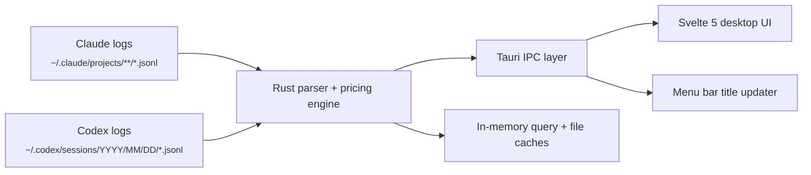

<p align="center">
  
</p>

<h1 align="center">TokenMonitor</h1>

<p align="center">
  <strong>Local-first macOS menu bar usage monitor for Claude Code and Codex</strong>
</p>

<p align="center">
  Tracks real spend, tokens, models, session pace, and history directly from on-disk usage logs.
</p>

<p align="center">
  
  
  
  
  
  
</p>

---

TokenMonitor is a local-first macOS menu bar app for monitoring Claude Code and Codex usage.

It parses Claude Code and Codex session logs locally, applies provider-aware pricing rules, and presents current-session, historical, and per-model usage in a compact macOS UI.

No API keys. No cloud sync. No runtime dependency on `ccusage` or another external usage CLI for usage parsing.

## Feature Summary

- Native macOS menu bar app with popover UI and optional live tray spend display
- Claude, Codex, and merged provider views
- Historical navigation across `5h`, `day`, `week`, `month`, and `year`
- Per-model cost and token breakdowns with model hiding/filtering
- Bar and line chart modes for cost-by-model exploration
- Monthly calendar heatmap with plan-aware monthly context
- Active-session footer with live burn rate and 5-hour spend context
- Provider rate-limit windows with utilization, reset timing, pace hints, and cooldown handling when available
- Launch-at-login, theme, refresh, currency, and branding controls
- Local settings persistence

## Overview

TokenMonitor is designed to make local usage data easier to read and act on.

- Usage history is read directly from local Claude Code and Codex session logs
- Spend is calculated with provider-aware pricing logic rather than a flat token total
- Current-session data, historical summaries, charts, and per-model breakdowns are available in one menu bar UI
- Rate-limit windows, when available, are shown alongside spend and usage context
- Cached views and background refreshes keep navigation responsive during normal use

## Data Sources

### Usage History

| Provider | Default path | Discovery behavior |
|---|---|---|
| Claude Code | `~/.claude/projects/**/*.jsonl` | Also checks `$CLAUDE_CONFIG_DIR/projects` when set |
| Codex CLI | `~/.codex/sessions/YYYY/MM/DD/*.jsonl` | Also respects `$CODEX_HOME/sessions` when set |

TokenMonitor works from usage data you already have on disk. If no logs are present yet, the app stays idle until Claude Code or Codex generates them.

### Rate-Limit Data

Rate-limit visibility is separate from usage history parsing:

- Claude rate limits use the local Claude authentication state already present on the machine and fall back to Claude CLI rate-limit events when needed
- Codex rate limits are read from recent session metadata in local Codex JSONL files

Usage history and cost analytics stay local. Optional rate-limit panels may use authenticated provider data already available on the machine.

## Pricing Fidelity

TokenMonitor is designed to answer the question that matters in practice: "What did this usage really cost?"

For Claude models, cache traffic is not treated as a single bucket. TokenMonitor reads the cache-creation breakdown from Claude logs and distinguishes between 5-minute and 1-hour cache writes before pricing them.

For Codex and OpenAI models, cached input is kept separate from standard input, and Codex `token_count` events are normalized into billable deltas whether the source log emits per-turn usage or cumulative totals. Reasoning output is folded into output billing where applicable.

This keeps cost calculation aligned with provider-specific billing behavior reflected in the source logs.

### Claude cache-write tiers

| Model | 5m Cache Write | 1h Cache Write | Difference |
|---|---:|---:|---:|
| Opus 4.6 | $6.25 / MTok | $10.00 / MTok | +60% |
| Sonnet 4.6 | $3.75 / MTok | $6.00 / MTok | +60% |
| Haiku 4.5 | $1.25 / MTok | $2.00 / MTok | +60% |

## Performance

- **Native Rust parser** caches parsed file entries by file stamp, so unchanged log files are not reparsed unnecessarily
- **Frontend payload cache** keys by provider, period, and offset for immediate repeat loads
- **Stale-while-revalidate fetch path** shows cached data instantly and refreshes silently in the background
- **Cache warming** preloads adjacent history windows and common periods so navigation feels immediate
- **Selective scanning strategy** reduces unnecessary file work for short-lived views
- **Background refresh** invalidates aggregate payloads without throwing away parsed-file reuse

## Installation

### Build From Source

```bash
git clone https://github.com/Michael-OvO/TokenMonitor.git
cd TokenMonitor
npm install
npx tauri build
```

Bundle output:

```text
src-tauri/target/release/bundle/
```

### Development

```bash
npm install
npx tauri dev
```

The app runs as a menu bar utility. Click the tray icon to open the popover.

## Requirements

- macOS 13 or newer
- Existing Claude Code and/or Codex usage logs on disk
- Node.js 18+ and Rust toolchain only if you are building from source

## Architecture



### Runtime Flow

1. The UI requests a provider, period, and optional historical offset through Tauri IPC.
2. The Rust backend scans relevant JSONL logs, normalizes provider-specific events, and prices each entry locally.
3. Aggregated payloads are cached in memory for fast repeat requests.
4. The frontend renders metrics, charts, model summaries, calendar views, and footer state.
5. A background loop refreshes the tray title and emits update events on the configured interval.

### Parsing Notes

- Claude parsing skips non-assistant entries and intermediate streaming noise
- Codex parsing normalizes both per-turn and cumulative `token_count` events into deltas
- Cross-provider merge mode preserves period semantics while combining totals
- Historical navigation is offset-based, which keeps the UI simple while letting the backend stay date-aware

## Validation

```bash
./node_modules/.bin/tsc --noEmit
npm test -- --run
npm run build
cargo clippy --manifest-path src-tauri/Cargo.toml --all-targets -- -D warnings
cargo test --manifest-path src-tauri/Cargo.toml
```

Convenience command:

```bash
npm run test:all
```

## Project Structure

```text
TokenMonitor/
├── src/
│   ├── App.svelte
│   └── lib/
│       ├── bootstrap.ts
│       ├── components/
│       ├── stores/
│       ├── types/
│       └── utils/
├── src-tauri/
│   └── src/
│       ├── commands.rs
│       ├── lib.rs
│       ├── models.rs
│       ├── parser.rs
│       ├── pricing.rs
│       └── rate_limits.rs
├── docs/
├── DEVELOPMENT.md
├── package.json
└── README.md
```

## Tech Stack

| Layer | Technology |
|---|---|
| Desktop shell | [Tauri v2](https://v2.tauri.app/) |
| Frontend | [Svelte 5](https://svelte.dev/) + TypeScript |
| Backend | Rust |
| Build tool | [Vite 6](https://vitejs.dev/) |
| State path | Local JSONL parsing + Tauri IPC + Svelte stores |

## Contributing

Issues and pull requests are welcome, especially around:

- new provider support
- pricing-model accuracy
- performance on large local histories
- UI polish and visualization improvements
- packaging and distribution

If you use Claude Code or Codex heavily, this repo is intended to be a practical, inspectable foundation for local usage observability.

## License

Licensed under the [GNU General Public License v3.0](LICENSE).
