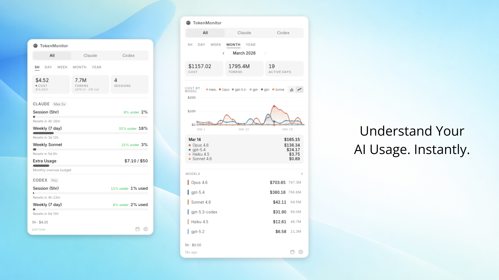
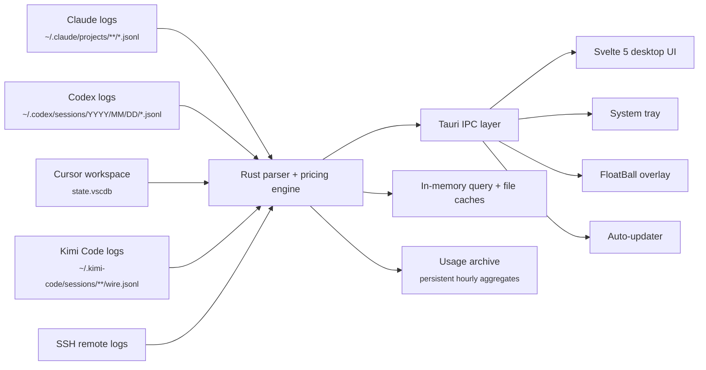

<p align="center">
  
</p>

<h1 align="center">TokenMonitor</h1>

<p align="center">
  <strong>Local-first cross-platform system tray app for monitoring Claude Code, Codex CLI, Cursor IDE, and Kimi Code token usage</strong>
</p>

<p align="center">
  A fast, compact way to understand spend, burn rate, model mix, and usage history without leaving the desktop.
</p>

<p align="center">
  
  
  
  
  
  
</p>

<p align="center">
  
</p>

<p align="center">
  <a href="https://github.com/Michael-OvO/TokenMonitor/releases/latest">
    
  </a>
  <a href="https://github.com/Michael-OvO/TokenMonitor/releases/latest">
    
  </a>
  <a href="https://github.com/Michael-OvO/TokenMonitor/releases/latest">
    
  </a>
  <a href="#build-it-yourself-in-three-steps">
    
  </a>
</p>

---

TokenMonitor is a local-first system tray app for people who use Claude Code, Codex CLI, Cursor IDE, or Kimi Code heavily and want a compact way to watch spend, burn rate, model mix, and rate limits without leaving the desktop.

It reads the session logs already on your machine, prices them in Rust, and shows the result in a tray popover. No API key is needed for usage history, nothing is synced to the cloud, and there is no runtime dependency on `ccusage` or any other CLI.

## Download

Grab the installer for your platform from the [latest release](https://github.com/Michael-OvO/TokenMonitor/releases/latest):

| Platform | Installer | Notes |
|----------|-----------|-------|
| **macOS** | `.dmg` | Drag to Applications, then see the unsigned-build note below |
| **Windows** | `.exe` (NSIS) | Run the installer |
| **Linux** | `.deb` | `sudo dpkg -i token-monitor_*.deb` |

## Build it yourself in three steps

New to the repo? This is the whole process.

### 1. Install the environment

| Tool | What to install |
|---|---|
| Node.js + npm | Node 18 or newer. CI builds with Node 26 and npm 11, which is what the lockfile is written by. |
| Rust | A current stable toolchain from [rustup](https://rustup.rs/). |
| macOS | Xcode Command Line Tools: `xcode-select --install` |
| Windows | Visual Studio C++ Build Tools and WebView2 (preinstalled on Windows 11) |
| Linux | `sudo apt install libwebkit2gtk-4.1-dev libappindicator3-dev librsvg2-dev patchelf` |

### 2. Build

```bash
git clone https://github.com/Michael-OvO/TokenMonitor.git
cd TokenMonitor
npm ci
npx tauri build
```

Want a live app while you change it? `npx tauri dev` runs it with a hot-reloading frontend and a debug Rust backend instead. Quit any running TokenMonitor from the tray first, it is single-instance.

### 3. Done

The installer is under `src-tauri/target/release/bundle/`:

| Platform | Output |
|----------|--------|
| macOS | `dmg/TokenMonitor_x.y.z_<arch>.dmg` |
| Windows | `nsis/TokenMonitor_x.y.z_x64-setup.exe` |
| Linux | `deb/token-monitor_x.y.z_amd64.deb` |

> [!IMPORTANT]
> **macOS builds are unsigned.** The project has no Apple Developer certificate, so
> nothing is code-signed or notarized, and no build step can change that. An app you
> built on your own Mac opens normally. A DMG downloaded from GitHub carries the
> quarantine flag, and Gatekeeper reports it as *"damaged and can't be opened"*. The
> file is fine; clear the flag once after dragging it to Applications:
>
> ```bash
> xattr -cr /Applications/TokenMonitor.app
> ```
>
> In-app auto-updates are unaffected: they are verified with the Tauri updater
> (minisign) key, which is independent of Apple code signing.

## What it shows

- **Spend and pace.** The official 5-hour window, plus `day`, `week`, `month`, and `year` views with history browsing, per provider or merged.
- **Model mix.** Per-model cost and token breakdowns, bar, line, and pie charts, a calendar heatmap, and agent/subagent cost shares.
- **Rate limits.** Claude, Codex, Cursor, and Kimi utilization with reset timing and pace hints. Claude limits come from the optional statusline TokenMonitor installs into Claude Code, so they are server-reported and need no extra request.
- **Accurate pricing.** Claude cache writes split into 5-minute and 1-hour tiers, Codex cached input separated from standard input, reasoning tokens billed as output, and models missing from the built-in table priced through LiteLLM or OpenRouter with a 24-hour cache.
- **Desktop niceties.** Tray spend text, an optional always-on-top FloatBall, launch at login, native glass effects, themes, currencies with live exchange rates, import/export, SSH remote devices, and an in-app auto-updater.

## Where the data comes from

Nothing leaves your machine. If no logs exist yet, the app stays idle until a provider writes some.

| Provider | Default path | Discovery behavior |
|---|---|---|
| Claude Code | `~/.claude/projects/**/*.jsonl` | Also checks `$CLAUDE_CONFIG_DIR/projects` when set |
| Codex CLI | `~/.codex/sessions/YYYY/MM/DD/*.jsonl` | Also respects `$CODEX_HOME/sessions` when set |
| Cursor IDE | Cursor workspace storage `state.vscdb` | Auto-detected from Cursor's local data directory |
| Kimi Code | `~/.kimi-code/sessions/**/wire.jsonl`, `~/.kimi/sessions/**/wire.jsonl` | Also respects `$KIMI_DATA_DIR` (comma-separated) |

Rate limits are read separately: Claude from statusline events with OAuth and CLI probes as fallbacks, Codex from recent session metadata, Cursor from its API using a stored key or the IDE's own login, and Kimi from its usage API with the same token refresh the Kimi CLI performs. Completed hours are persisted to a usage archive, so history survives log deletion.

## Platform differences

| Feature | macOS | Windows | Linux |
|---------|-------|---------|-------|
| System tray icon | Menu bar | System tray | System tray |
| Cost display | Text beside the icon | Tooltip on hover | Tooltip on hover |
| Rate limits (Claude) | Statusline, OAuth/CLI fallback | Statusline, CLI fallback | Statusline, CLI fallback |
| Rate limits (Cursor) | API, token auto-detected or manual | API, token auto-detected or manual | API, manual token |
| Glass effect | Vibrancy | Mica/Acrylic | Not available |
| Dock icon toggle | Supported | Not applicable | Not applicable |
| Autostart | LaunchAgent | Registry | XDG autostart |
| Auto-update | DMG in-place replace | NSIS passive install | AppImage replace (.deb shows a download link) |
| Installer | DMG, unsigned (see above) | NSIS `.exe` | `.deb` / `.AppImage` |

## Development

```bash
npx tauri dev          # full app: hot-reload frontend + debug Rust backend
npm run dev            # frontend only at http://localhost:1420 (no native IPC)
npm test               # frontend unit tests (Vitest)
npm run test:rust      # Rust tests (cargo test)
npm run test:all       # both
```

CI also runs `npx svelte-check`, `cargo fmt --check`, and `cargo clippy --all-targets -- -D warnings`. Versions must match across `package.json`, `src-tauri/Cargo.toml`, `src-tauri/Cargo.lock`, and `src-tauri/tauri.conf.json`; `npm run release -- X.Y.Z` bumps them, tags, and pushes, and the tag triggers the release workflow. Repository layout, runtime flow, conventions, and troubleshooting live in the [development guide](docs/DEVELOPMENT.md).

## Architecture


```mermaid
graph LR
    A["Claude logs<br/><sub>~/.claude/projects/**/*.jsonl</sub>"] --> B["Rust parser + pricing engine"]
    D["Codex logs<br/><sub>~/.codex/sessions/YYYY/MM/DD/*.jsonl</sub>"] --> B
    K["Cursor workspace<br/><sub>state.vscdb</sub>"] --> B
    M["Kimi Code logs<br/><sub>~/.kimi-code/sessions/**/wire.jsonl</sub>"] --> B
    S["SSH remote logs"] --> B
    B --> C["Tauri IPC layer"]
    C --> E["Svelte 5 desktop UI"]
    C --> F["System tray"]
    C --> H["FloatBall overlay"]
    C --> U["Auto-updater"]
    B --> G["In-memory query + file caches"]
    B --> AR["Usage archive<br/><sub>persistent hourly aggregates</sub>"]
```

[Tauri v2](https://v2.tauri.app/) shell, [Svelte 5](https://svelte.dev/) + TypeScript frontend built with [Vite](https://vite.dev/), Rust backend. Local JSONL logs go through the Rust parsers and pricing into in-memory and disk caches, over Tauri IPC into Svelte stores, and onto the screen.

## Documentation

- [Tutorial](docs/tutorial.md): installation, onboarding, daily use, and troubleshooting
- [Development guide](docs/DEVELOPMENT.md): repository layout, validation, and releases
- [Changelog](CHANGELOG.md): release history
- [Updater test matrix](docs/testing/auto-update.md): release-candidate smoke tests

## Contributing

Issues and pull requests are welcome, especially around pricing accuracy, performance on large histories, packaging, new providers, and cross-platform behavior.

## License

Licensed under the [GNU General Public License v3.0](LICENSE).
